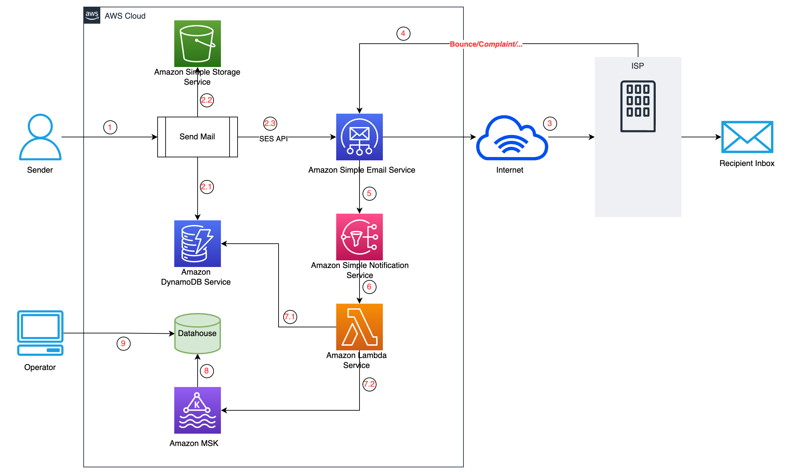
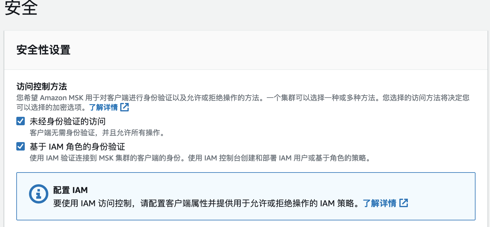
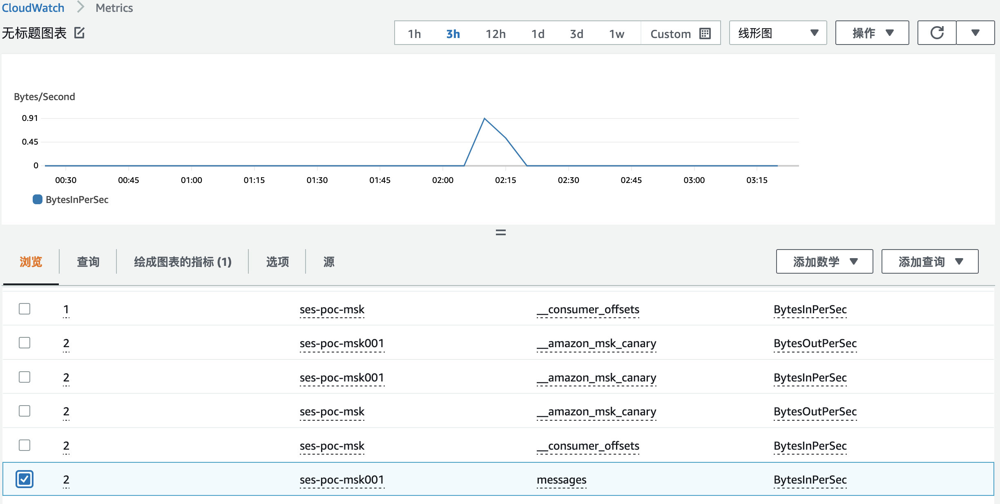

# AWS SES 邮件事件处理

AWS SES 有丰富的邮件事件通知，通过捕获这些事件和分析事件数据可以满足客户不同场景的统计分析需求。本项目通过AWS SNS接受SES事件，然后触发Lambda获取事件数据，并结合邮件元数据，拼接成Kafka消息，供后续数仓消费。
## 目录

- [AWS SES 邮件事件处理](#aws-ses-邮件事件处理)
  - [目录](#目录)
    - [上手指南](#上手指南)
          - [配置要求](#配置要求)
          - [安装步骤](#安装步骤)
    - [文件目录说明](#文件目录说明)
    - [部署](#部署)
    - [部署AWS MSK](#部署aws-msk)
      - [创建Topic](#创建topic)
    - [部署AWS DynamoDB](#部署aws-dynamodb)
    - [部署Lambda](#部署lambda)
      - [创建Lambda函数](#创建lambda函数)
      - [创建Lambda 执行角色，添加以下策略](#创建lambda-执行角色添加以下策略)
      - [设置Lambda 函数](#设置lambda-函数)
    - [设置SES、SNS](#设置sessns)
      - [创建 SES 事件触发规则](#创建-ses-事件触发规则)
      - [创建 SNS 触发规则](#创建-sns-触发规则)
      - [触发测试邮件](#触发测试邮件)
    - [版本控制](#版本控制)
    - [参考](#参考)
    - [作者](#作者)

### 上手指南

方案说明：
1. 客户通过应用程序发送邮件
2. 处理邮件发送
    1. 把邮件信息存入DynamoDB
    2. 把邮件内容存入S3
    3. 调用SES API进行邮件发送
3. 接收方ISP，收到SES发送的邮件，并进行处理
4. 反馈邮件处理状态到SES（地址不存在 Bounce/ 被投诉 Complaint等）
5. SES根据配置的事件状态发消息发送给SNS
6. SNS触发处理Lambda函数
7. Lambda函数进行消息拼接处理和发送到Kafka
    1. 根据邮件ID（MessageId）从DynamoDB中获取邮件信息，结合事件消息进行消息拼接
    2. 把拼接的消息写入Kafka
8. 消费Kafka把消息同步到数仓之中
9. 运营人员使用原有的逻辑进行分析即可

###### 配置要求

1. Lambda Java 11

###### 安装步骤
```sh
git clone https://github.com/hillday/ses-kafka-producer.git

# 程序打包成zip
mvn clean package
```

### 文件目录说明

```
ses-kafka-producer 
├── README.md
├── /images/
├── /src/ # 源程序代码
├── ddb_item_mock.json # 模拟的dynamodb记录
```

### 部署
主要是部署Lambda和设置SNS，同时需要创建一个AWS MSK集群和一张AWS DynamoDB表。
### 部署AWS MSK
参考[创建MSK](https://docs.aws.amazon.com/zh_cn/msk/latest/developerguide/msk-create-cluster.html)。需要开启IAM权限验证的方式，后续Lambda通过IAM权限访问Kafka。


#### 创建Topic
创建一个`messages`名字的AWS MSK Topic
```
bin/kafka-topics.sh --create --bootstrap-server b-2.xxxx.dsn04d.c18.kafka.xxx.amazonaws.com:9092,b-1.xxxx.dsn04d.c18.kafka.xxxx.amazonaws.com:9092 --replication-factor 3 --partitions 1 --topic messages
```

### 部署AWS DynamoDB
创建一张`ses_my_poc`表，用于存储发送的历史邮件元信息：
1. 发件人为PrimaryKey，如（xxx@example.com）
2. 邮件消息ID和日期为 SortKey，如（ssdfasdf#2022-12-10 12:00）
其他属性可以动态根据需要添加。参考`ddb_item_mock.json`，通过AWS Cli 添加模拟记录：
```
aws dynamodb put-item \
    --table-name ses_my_poc \
    --item file://ddb_item_mock.json \
    --return-consumed-capacity TOTAL \
    --return-item-collection-metrics SIZE
```

### 部署Lambda
Lambda 部署需要：
1. 创建Lambda函数
2. 创建Lambda执行角色
3. Lambda 设置

#### 创建Lambda函数
创建Lambda函数`SesKafkaPoc`,把程序包`SESLambdaProxy.zip`上传到Lambda(可以先上传到S3，在复制S3链接).
> 兼容架构选择 `x86_64` 获取 `ARM`

> 兼容运行时选择 `Java 11`

#### 创建Lambda 执行角色，添加以下策略
1. 内联策略`LambdaInlinePolicy`

```json
{
    "Version": "2012-10-17",
    "Statement": [
        {
            "Effect": "Allow",
            "Action": [
                "kafka-cluster:Connect",
                "kafka-cluster:AlterCluster",
                "kafka-cluster:DescribeCluster"
            ],
            "Resource": [
                "arn:aws:kafka:REGION:ACCOUNT:cluster/ses-poc-msk001/47baf0c6-bb4e-4aa7-9a55-f6eb37bea57e-18"
            ]
        },
        {
            "Effect": "Allow",
            "Action": [
                "kafka-cluster:*Topic*",
                "kafka-cluster:WriteData",
                "kafka-cluster:ReadData"
            ],
            "Resource": [
                "arn:aws:kafka:REGION:ACCOUNT:topic/ses-poc-msk001/*"
            ]
        },
        {
            "Effect": "Allow",
            "Action": [
                "kafka-cluster:AlterGroup",
                "kafka-cluster:DescribeGroup"
            ],
            "Resource": [
                "arn:aws:kafka:REGION:ACCOUNT:group/ses-poc-msk001/*"
            ]
        },
        {
            "Effect": "Allow",
            "Action": [
                "dynamodb:BatchGetItem",
                "dynamodb:GetItem",
                "dynamodb:Scan",
                "dynamodb:Query"
            ],
            "Resource": "arn:aws:dynamodb:REGION:ACCOUNT:table/ses_my_poc"
        }
    ]
}
```
添加AWS托管的`AWSLambdaVPCAccessExecutionRole`策略。
*需要把json文档中的`REGION`,`ACCOUNT`替换为实际的区域、账号*

#### 设置Lambda 函数
* 环境变量设置
  `bootstrap_server`:为AWS MSK IAM客户端连接点。
* VPC设置，如果AWS MSK 部署在VPC 中,需要设置Lambda VPC，部署到和AWS MSK同一VPC中。

*执行角色选择为上面的创建的角色。*


### 设置SES、SNS
#### 创建 SES 事件触发规则
参考[AWS SES 事件通知](https://docs.aws.amazon.com/zh_cn/ses/latest/dg/monitor-sending-activity-using-notifications-sns.html)。

#### 创建 SNS 触发规则
在SNS设置Lambda为接受目标。参考[SNS结合Lambda联合使用](https://docs.aws.amazon.com/zh_cn/lambda/latest/dg/with-sns-example.html)。

#### 触发测试邮件
[Amazon SES 中发送测试电子邮件](https://docs.aws.amazon.com/zh_cn/ses/latest/dg/send-an-email-from-console.html),发送完成后可以在CloudWatch查看Topic流量情况，已确定是否把消息发送到Kafka。


### 版本控制

该项目使用Git进行版本管理。您可以在repository参看当前可用版本。

### 参考
[Lambda-Java-SES-Event](https://github.com/asuresh8/Lambda-Java-SES-Event.git)
[serverless-kafka-producer](https://github.com/aws-samples/serverless-kafka-producer.git)

### 作者

qchunhai
